# AyuSetu Full UML and Architecture (Mermaid)

This document captures the current architecture from the codebase in:
- `backend` (Express + MongoDB + Socket.IO)
- `frontend` (React + Vite)

## 1) System Context Diagram

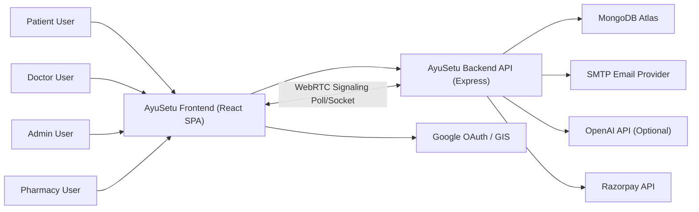

## 2) Container / Runtime Diagram

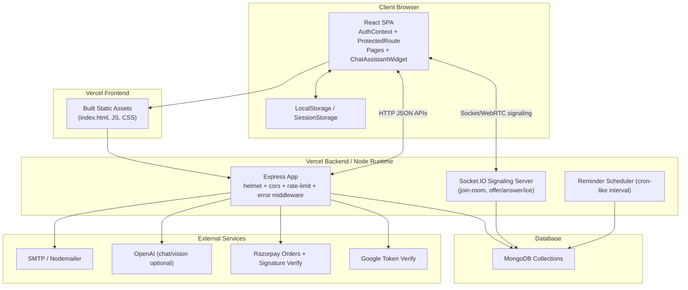

## 3) Backend Module Diagram

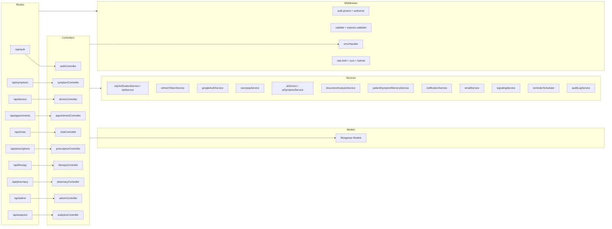

## 4) Database ER Diagram (Current Collections)

```mermaid
erDiagram
    USER {
      ObjectId _id PK
      string fullName
      string email UK
      string phone UK
      string passwordHash
      string authProvider
      string googleSub
      string role
      bool isVerified
      bool isActive
      number failedLoginAttempts
      date lockUntil
      date lastPasswordChangedAt
      object profile
      object doctorProfile
      object pharmacyProfile
      date lastLoginAt
      date createdAt
      date updatedAt
    }

    ROLE {
      ObjectId _id PK
      string key UK
      string name
      bool isActive
      date createdAt
      date updatedAt
    }

    LOGIN_PROVIDER {
      ObjectId _id PK
      ObjectId userId FK
      string provider
      string providerUserId
      string email
      bool isPrimary
      date linkedAt
      date createdAt
      date updatedAt
    }

    OTP_VERIFICATION {
      ObjectId _id PK
      ObjectId userId FK
      string email
      string purpose
      string otpHash
      date expiresAt
      date consumedAt
      number attempts
      number maxAttempts
      date resendAvailableAt
      number sentCount
      object metadata
      date createdAt
      date updatedAt
    }

    OTP_CODE {
      ObjectId _id PK
      string phone
      string purpose
      string codeHash
      date expiresAt
      number attempts
      date consumedAt
      date createdAt
      date updatedAt
    }

    REFRESH_TOKEN {
      ObjectId _id PK
      ObjectId userId FK
      string tokenHash
      date expiresAt
      date revokedAt
      string replacedByTokenHash
      string createdByIp
      string revokedByIp
      string userAgent
      date createdAt
      date updatedAt
    }

    APPOINTMENT_PAYMENT {
      ObjectId _id PK
      ObjectId patientId FK
      ObjectId doctorId FK
      string slotDate
      string slotTime
      string consultationType
      string symptomSummary
      number amount
      string currency
      string receipt UK
      string razorpayOrderId UK
      string razorpayPaymentId
      string razorpaySignature
      string status
      string failureReason
      date expiresAt
      date createdAt
      date updatedAt
    }

    APPOINTMENT {
      ObjectId _id PK
      string appointmentCode UK
      ObjectId patientId FK
      ObjectId doctorId FK
      string slotDate
      string slotTime
      date startAt
      date endAt
      string consultationType
      string symptomSummary
      string aiSymptomSummary
      object meeting
      object payment
      string status
      string notesByDoctor
      string cancelReason
      date createdAt
      date updatedAt
    }

    DOCTOR_AVAILABILITY {
      ObjectId _id PK
      ObjectId doctorId FK
      string date
      string timezone
      array slots
      date createdAt
      date updatedAt
    }

    CONSULTATION_SIGNAL {
      ObjectId _id PK
      string roomId
      ObjectId appointmentId FK
      ObjectId fromUserId FK
      string fromRole
      string fromUserName
      string type
      object payload
      date createdAt
      date updatedAt
    }

    SYMPTOM_HISTORY {
      ObjectId _id PK
      ObjectId userId FK
      array symptoms
      string lifestyle
      string language
      string inputMode
      object triage
      array recommendations
      string doshaImbalance
      string source
      ObjectId reviewedByDoctorId FK
      date timestamp
      date createdAt
      date updatedAt
    }

    PATIENT_SYMPTOM_MEMORY {
      ObjectId _id PK
      ObjectId userId FK, UK
      array topSymptoms
      array likelyCauses
      string lastAssistantName
      array entries
      date createdAt
      date updatedAt
    }

    CHAT_SESSION {
      ObjectId _id PK
      ObjectId patientId FK
      ObjectId doctorId FK
      string channel
      string assistantName
      string status
      ObjectId linkedAssessmentId FK
      array messages
      date createdAt
      date updatedAt
    }

    PRESCRIPTION {
      ObjectId _id PK
      ObjectId appointmentId FK
      ObjectId patientId FK
      ObjectId doctorId FK
      array diagnosis
      array medicines
      string advice
      date followUpDate
      string qrToken UK
      string pdfUrl
      string status
      date issuedAt
      date createdAt
      date updatedAt
    }

    THERAPY_PLAN {
      ObjectId _id PK
      ObjectId patientId FK
      ObjectId doctorId FK
      string therapyType
      string startDate
      number totalSessions
      array sessions
      number progressPercent
      string status
      date createdAt
      date updatedAt
    }

    MEDICINE_INVENTORY {
      ObjectId _id PK
      ObjectId pharmacyId FK, UK
      array items
      date createdAt
      date updatedAt
    }

    NOTIFICATION {
      ObjectId _id PK
      ObjectId userId FK
      string type
      string title
      string body
      string channel
      object payload
      string status
      date sentAt
      date readAt
      date createdAt
      date updatedAt
    }

    AUDIT_LOG {
      ObjectId _id PK
      ObjectId userId FK
      string action
      string status
      string ip
      string userAgent
      object metadata
      date createdAt
      date updatedAt
    }

    USER ||--o{ LOGIN_PROVIDER : has
    USER ||--o{ REFRESH_TOKEN : owns
    USER ||--o{ OTP_VERIFICATION : receives
    USER ||--o{ SYMPTOM_HISTORY : submits
    USER ||--|| PATIENT_SYMPTOM_MEMORY : accumulates
    USER ||--o{ CHAT_SESSION : participates
    USER ||--o{ APPOINTMENT : books_patient
    USER ||--o{ APPOINTMENT : serves_doctor
    USER ||--o{ APPOINTMENT_PAYMENT : pays_patient
    USER ||--o{ APPOINTMENT_PAYMENT : receives_doctor
    USER ||--o{ DOCTOR_AVAILABILITY : publishes
    USER ||--o{ PRESCRIPTION : receives_patient
    USER ||--o{ PRESCRIPTION : issues_doctor
    USER ||--o{ THERAPY_PLAN : follows_patient
    USER ||--o{ THERAPY_PLAN : manages_doctor
    USER ||--|| MEDICINE_INVENTORY : owns_pharmacy
    USER ||--o{ NOTIFICATION : receives
    USER ||--o{ AUDIT_LOG : logged

    APPOINTMENT ||--o{ CONSULTATION_SIGNAL : emits
    APPOINTMENT ||--o| PRESCRIPTION : results_in
    APPOINTMENT ||--o{ NOTIFICATION : triggers
    SYMPTOM_HISTORY ||--o{ CHAT_SESSION : linked_assessment
```

## 5) Authentication Sequence (Signup/Login/Google + OTP + JWT)

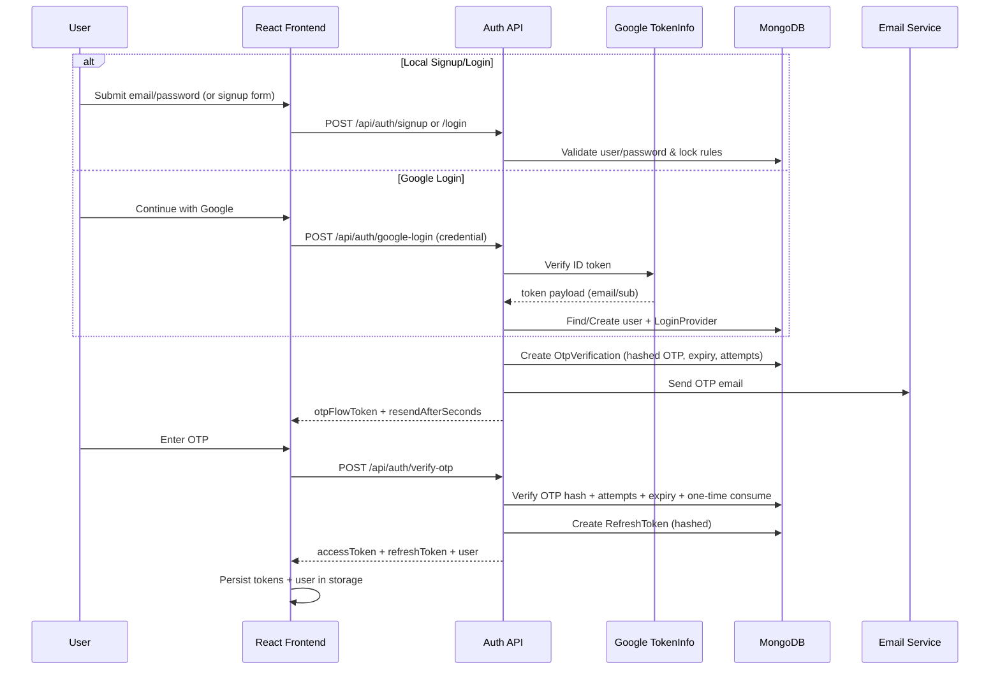

## 6) Appointment Booking Sequence with Razorpay

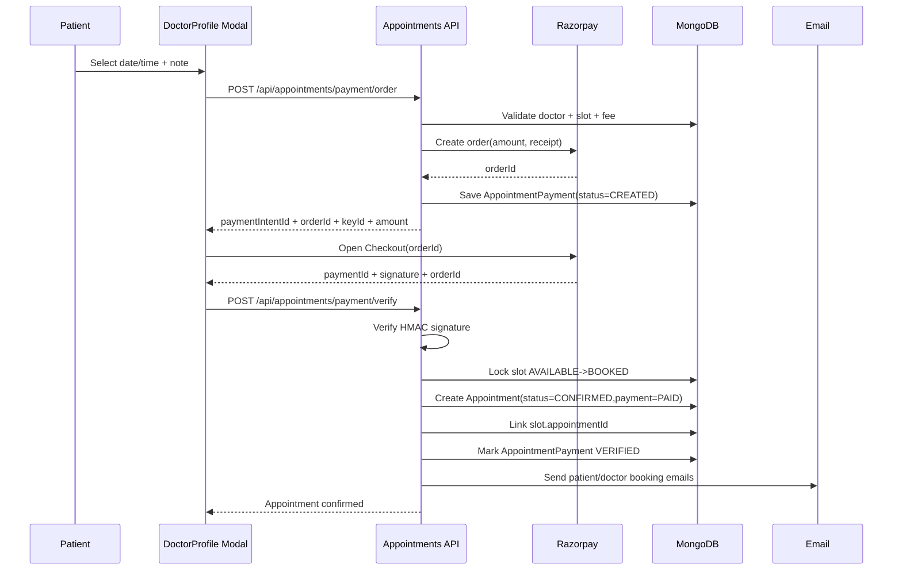

## 7) Consultation Signaling / WebRTC Sequence

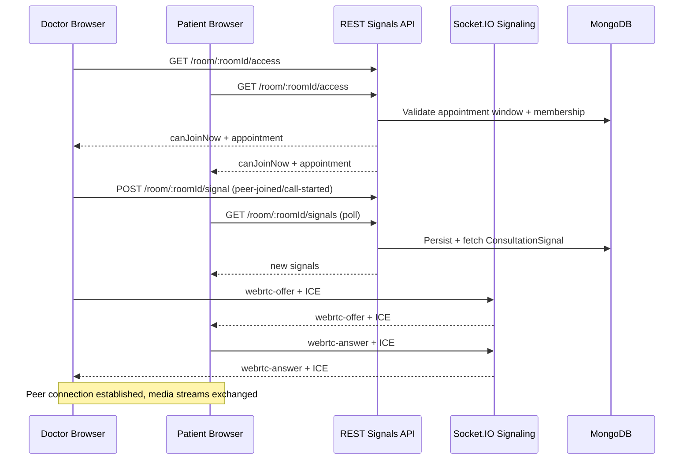

## 8) Appointment Lifecycle State Diagram

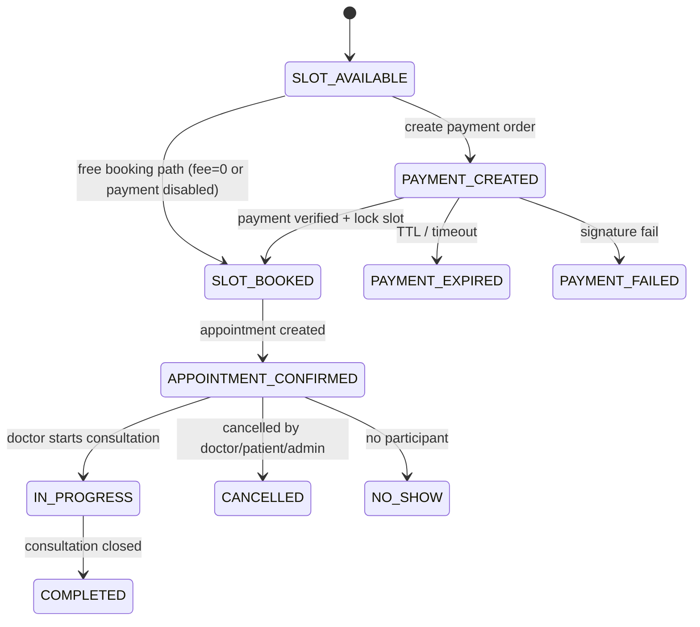

## 9) Frontend Route and Access Diagram

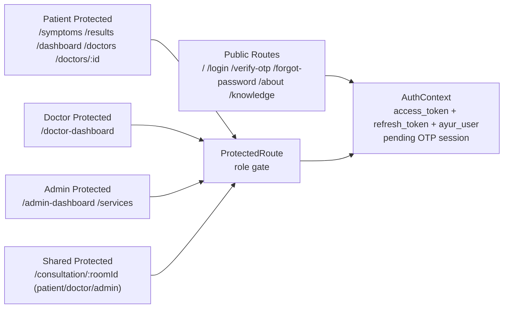

## 10) Deployment Diagram (Vercel-Based)

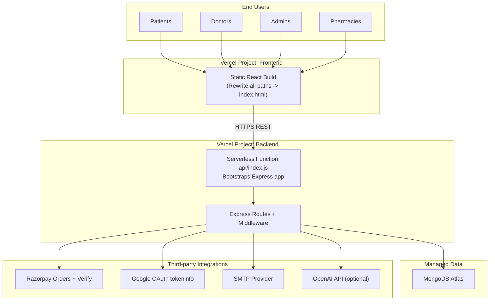

## 11) API Domain Map

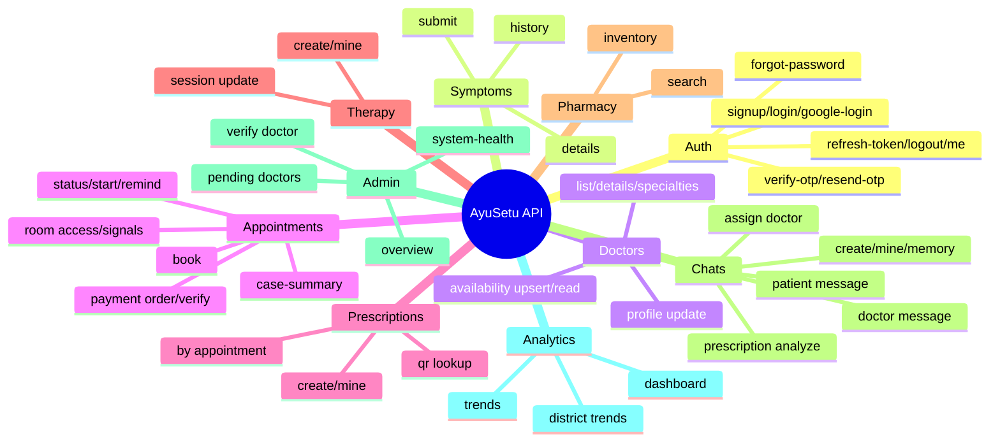
